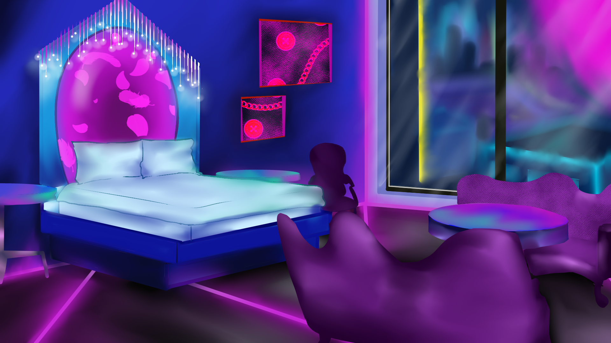

_"A cyberpunk visual novel where you play a secret agent with the power to control time - and maybe those around you."_

   

**Achievements: Ranked #33 of 121 game jam entries**


  {}
  {}
  {}
  {}


For Agents of Interest, I drew the title screen and the 11 backgrounds (non-character work) used throughout the visual novel. I worked with 5 other people who handled the character art, coding, music, writing and project management, and completed these drawings over two weeks. 

This was my first completed game or art project in several years, and was a good return to what I enjoy about drawing and game development. I utilized real-life references for the external architecture, mainly hotels around my local area, but reimagined the interiors in a futuristic setting. I enjoyed painting the lighting and learned a lot from my references. Most of the story had already been written by the time I joined the team, but in future projects I would love to be more creatively involved with the planning of the game.

Agents of Interest features Morgan, a secret agent on a mission to stop catastrophe. Morgan's abilities means that reality bends to her perception - time can bend to her will and enemies can become friends. The game takes inspiration from Cyberpunk 2077 and yuri visual novels with branching paths. 
