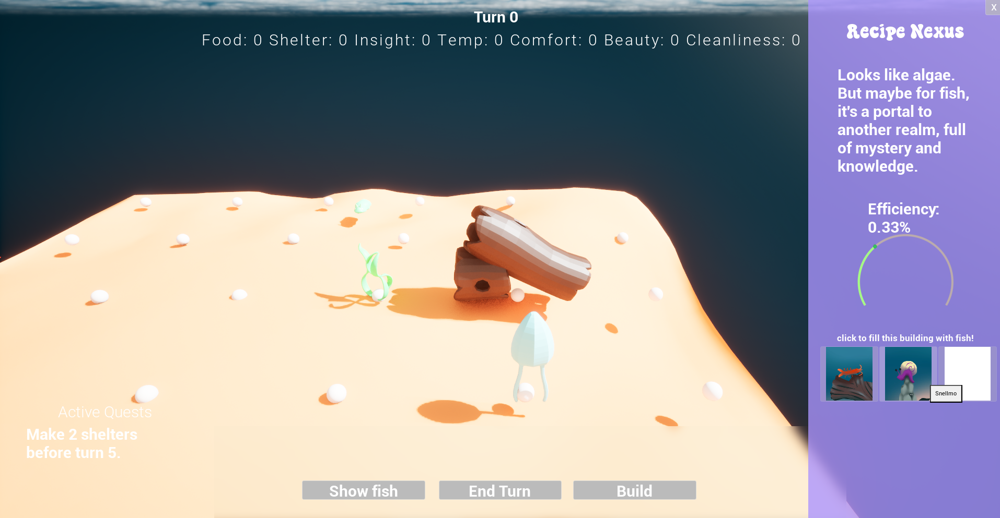

_"A city builder strategy game where you build an aquarium and watch fish grow and change."_

   


  {}
  {}
  {}
  {}
  {}


wacky-quarium! is my current project: right now it's in the prototype phase and I'm looking to test out the concepts, see if it's fun, find collaborators, maybe shift stuff around. Check out the project page to see more about it.

The inspiration for this game is that a big fan of aquariums (dreaming of shrimp tank) and I'm a big fan of city builder games like Frostpunk, Against the Storm, and Everdell. Initially I thought that a city builder based around the delicate balance of managing water quality in an aquarium could be fun, and a good excuse to learn Unreal Engine.  

Eventually I realized what I really wanted a game where you get to know the individual fish as you build a city for them, and so I've been evolving the game to reflect that. Now I'm approaching concepts more similar to Darkest Dungeon 2 where you choose certain destinations for fish, the fish accumulate quirks and develop bonds between each other; and the resource management is a bit less intense (which allows for the turn based nature). 

