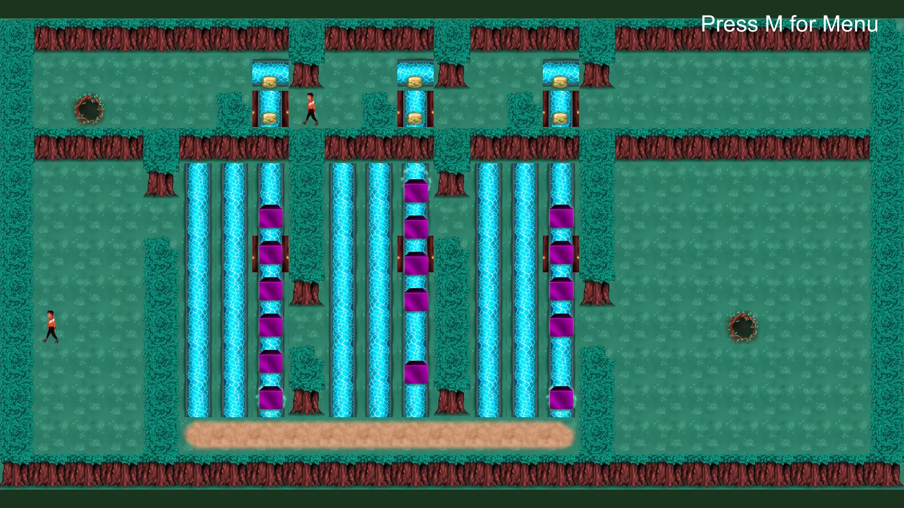

_"A puzzle game where a boy gets lost in a forest and finds an alternate version of himself. They work together to find a way out. Along the way, he meets more lost individuals and can choose how to interact with them, leading to multiple endings."_

    

											
I drew most of the tiles and characters for Clone and created 2D animations for them in Unity, and keyframed the ending cutscenes. I also implemented the dialogue system and added logic to track character responses and deliver alternate endings. I worked alongside 3 other developers, who did the game logic, puzzle design and some character writing.

Our goal in making this game was to build an interesting puzzle game with a small story element. The box puzzles were inspired by Baba is You and the story element is inspired by Catherine, where you meet NPCs after doing puzzle sections and choose to comfort or chastise them. The player controlling the main character and another character with inverted controls is inspired by old flash games.

For the art direction, I wanted to stick with cool-toned colors to reflect the somber, mystical mood of the game. We wanted the main character Pero to seem like a normal person lost in a strange place, so that went into his relatively simple design with an orange jacket for contrast. I used green and purple as contrasting colors throughout to symbolize the duality of the game: Pero and his clone, comfort or chastise, the two different endings and all that. Also I realize I did something similar in Mika's Forest, somehow this game feels like a spiritual successor to that.

Clone was developed as part of the Game Development and Design DeCal at UC Berkeley, a student-run class where groups of four developed a game over a semester while learning about art and game development best practices. 
