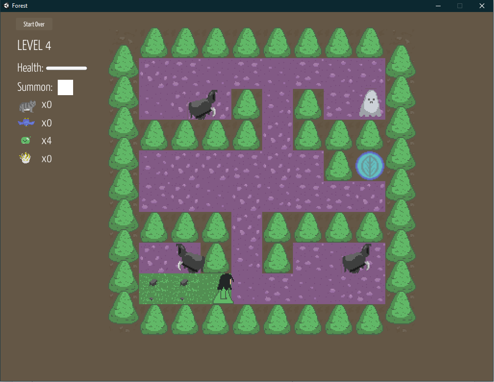

_"A puzzle game created for Mini Ludum Dare #69 where you flip tiles as other creatures attempt to flip them back, and send creatures of your own to intercept."_

   

_Mika's Forest was featured in [this article](https://gamejolt.com/p/jam-favorites-minild-69-check-out-some-games-made-for-the-minild-yinbhnb3) and [this video](https://www.youtube.com/watch?v=amjEUImOHHQ) by Jupiter Hadley!_

Mika's Forest was the first game I developed solo, and hopefully the last. I created the music, pixel art, narrative and programming for this game, and had to rush to meet the 2 week jam deadline. 

The premise was to combine two game mechanics I liked from other games: using "pets" to take out enemies from afar and trying to "cover" all of a level to win like Splatoon or Bomberman Reversi mode. This was also my first foray into tile generation, which I ended up using in a lot of my games. 

I learned a lot working on this, namely that two weeks is far too short to test out a puzzle game and that solo development is rough. While I did enjoy working on the various parts, I like being able to sink time into a specific area and split work as needed.

