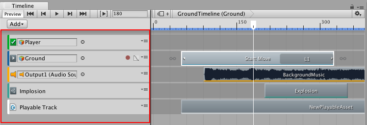

_"A research study that used 16 cutscenes to simulate different scenarios from the perspective of a user in a VR social space."_

  

I used Unity Timeline to create cutscenes that would be recorded into videos and used for social research. The cutscenes were each 2-8 minutes long and involved several characters moving in and out of frame, camera panning, voice lines with spatial audio, UI elements, and particle effects. I moved the models to record keyframes and inserted audio or effects as the scripts dictated.

The project required certain scenarios to share significant portions of animation so I explored the EditorTools API in Unity and built functionality to cut and paste keyframes, which was pretty useful and enabled me to distribute animation work to the other members of the research group.

---

This work was part of a research group of 4 undergrad students led by Vivek Rao under the UC Berkeley Design for Cybersecurity group. Each cutscene scenario presented the situation that you were in a VR comedy club and watched as another digital avatar rudely interrupted the performance and got subjected to moderation. 

For example, in some scenarios a moderator player might explain the rule violation and mute the violator, and in other scenarios the rule violator would just disappear. Sometimes there would be no moderator and nearby players would comment on how they were choosing to mute the violator, and there was even a scenario with a voting UI that showed nearby players voting to kick the violator. The research study intended to show these scenarios to people and discover people’s preferences of moderation on these scales (opaque vs transparent rules, centralized vs decentralized moderation, etc). 

The four of us designed the trial, completed making videos and were in the process of getting approval to run the trial. I don’t know if this study was ever conducted as the project was interrupted by the COVID-19 pandemic :( But it was really cool to be part of the scientific process for a bit, and made me realize that research is not my thing.
